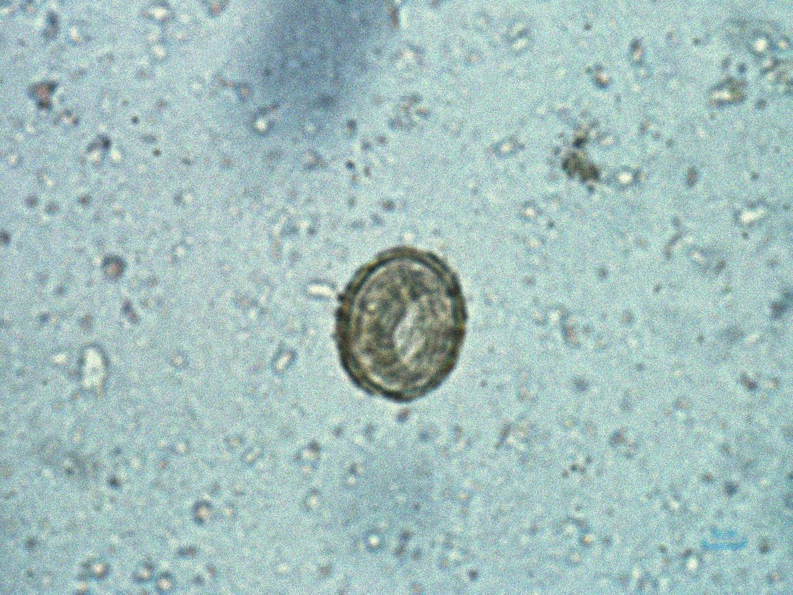
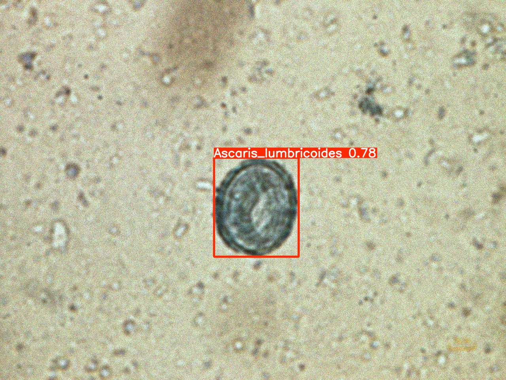
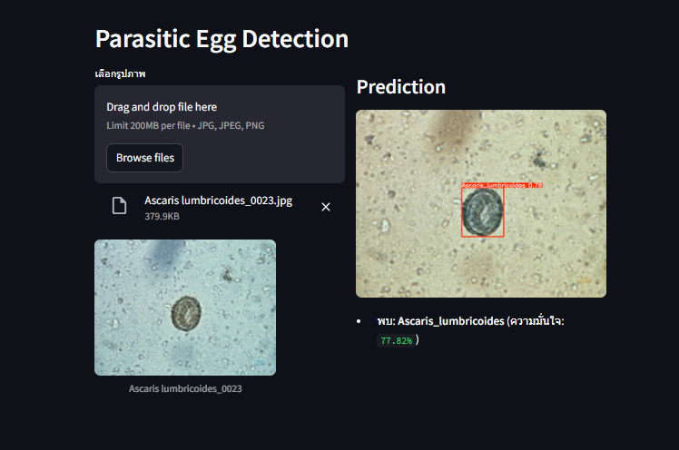

# 🧫 Parasitic Egg Detection

ระบบตรวจจับและจำแนกไข่พยาธิจากภาพกล้องจุลทรรศน์โดยใช้เทคนิค Deep Learning (Object Detection)

---

## 🎯 Project Overview
โปรเจกต์นี้มีวัตถุประสงค์เพื่อช่วยแพทย์และนักวิจัยในการตรวจหาไข่พยาธิใน
โดยใช้โมเดล **YOLOv8** สำหรับการตรวจจับวัตถุ (Object Detection) บนภาพกล้องจุลทรรศน์  
ผลลัพธ์คือการระบุชนิดและตำแหน่งของไข่พยาธิในภาพ

---

## ⚙️ Installation

### 1️ Clone โปรเจกต์นี้
```bash
git clone https://github.com/NonthawatNK/Parasitic_Egg_Detection.git
cd Parasitic_Egg_Detection
```

### 2 สร้าง Virtual Environment
```
python -m venv env
venv\Scripts\activate       # สำหรับ Windows
# หรือ
source venv/bin/activate    # สำหรับ macOS/Linux
```
### 3 Dependencies 
```
pip install -r requirements.txt
```
### 4 Usage 
```
streamlit run app.py
```

## Project structure
```
Parasitic_Egg_Detection/
├── env                   # Evronment สำหรับ project นี้
├── app.py                # Streamlit web interface
├── requirements.txt      # Dependencies
├── best.pt               # Model 
├── Dockerfile            # Dockerfile สำหรับ build เป็น image
└── README.md             # เอกสารนี้
```
## Model Information
- **Base Model**: YOLOv8 (Ultralytics)
- **Training Data**: ภาพกล้องจุลทรรศน์ของไข่พยาธิ (รวบรวมและ annotate ด้วยตนเอง)
- **Input Size**: 640 × 640 pixels
- **Output**:: Bounding box + ชื่อชนิดของไข่พยาธิ
- **Framework**:: PyTorch

## 📊 Example Results
| Input Image | Detection Result |
|--------------|------------------|
|  |  |

## APP
<p align="center">
  
  <br>
  <em>ผลลัพธ์การตรวจจับไข่พยาธิ</em>
</p>
